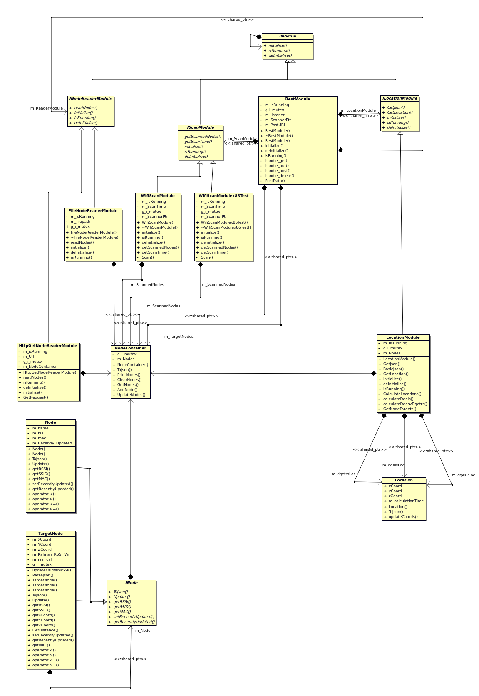

# Pink Panther
An Open-Source indoor geo-location framework developed by a team of graduate and undergraduate researchers at San Diego State University.  
This project was featured in the Q2 2020 edition of the International Journal of Interdisciplinary Telecommunications and Networking.  
<https://www.igi-global.com/article/real-time-indoor-geolocation-tracking-for-assisted-healthcare-facilities/247954>  
## Introduction  
This repository contains an Open-Source indoor geolocation framework, written in C++, which is designed to run on BSD-based embedded devices which have an 802.11 Wi-Fi chip. The framework is capable of deriving the location of a Wi-Fi sensor to within 3m accuracy when it the system is correctly calibrated. Theories of Trilateration are employed to derive the final location of the embedded sensor and Kalmann Filtering is used to reduce the error introduced by noise and multipath interference.  
  
The complete solution presented in the paper employs a web service component, embedded system component and a mobile application. This repository contains the embedded system component and the mobile application component.  

## Design  
The embedded system was designed using C++14 and OO Design principles to ensure a flexible, modular design.  
The UML for the embedded system design can be seen below in Figure 1:  
  
  
**Figure 1: Embedded Layer UML**  

